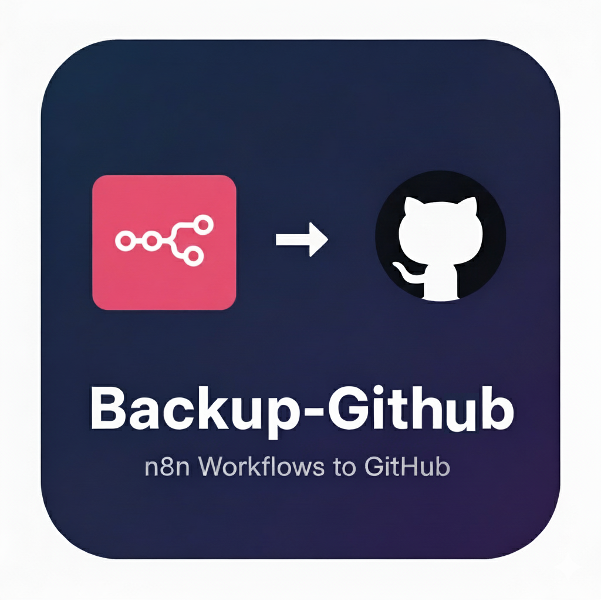
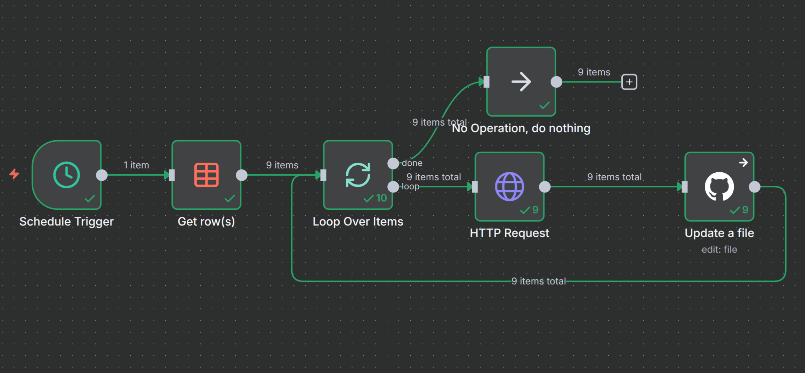

</p\>

# ⚙️ 1. Backup-GitHub: Sincronización de Workflows de n8n a GitHub

Este es un workflow de **n8n** diseñado para un propósito de "meta-automatización": **realizar copias de seguridad automáticas de otros workflows de n8n directamente en un repositorio de GitHub**.

El flujo se ejecuta de forma programada (semanalmente), lee una lista de workflows desde una Data Table de n8n, obtiene el JSON completo de cada uno a través de la API de n8n y, finalmente, los "pushea" o actualiza en el repositorio de GitHub especificado.

Su objetivo principal es mantener sincronizado el repositorio público [workflows-n8n-publicos](https://github.com/funkykespain/workflows-n8n-publicos) con las versiones más recientes de los flujos de trabajo en la instancia de n8n.

-----

## 📍 2. Propósito y Repositorio de Destino

Este workflow es la herramienta interna que alimenta el siguiente repositorio público. No está pensado para ser interactuado por usuarios finales, sino como una herramienta de CI/CD y backup para el desarrollador.

  - **Repositorio de Destino:** [https://github.com/funkykespain/workflows-n8n-publicos](https://github.com/funkykespain/workflows-n8n-publicos)

-----

## ⚙️ 3. Requisitos previos

Para que este workflow funcione, necesitarás:

  - Una instancia de **n8n** (local o en la nube).
  - Una **Data Table (Beta)** de n8n llamada `WorkflowsPublicos` con dos columnas:
      - `workflow_id` (string): El ID único del workflow en n8n (ej: `lRbVDC3V4oKquRU4`).
      - `workflow_name` (string): El nombre de la carpeta donde se guardará en GitHub (ej: `Backup-GitHub`).
  - Credenciales de API para:
      - **GitHub API**: Para poder escribir en el repositorio.
      - **n8n API (Header Auth)**: Para que el workflow pueda leer otros workflows de la misma instancia.

**Nota Importante:** Este workflow **no utiliza ningún LLM** (OpenAI, Mistral, Gemini) ni bases de datos vectoriales. Es una automatización pura de movimiento de datos.

-----

## 📦 4. Archivos incluidos

  - `Backup-GitHub.json`: El export completo del workflow de n8n.
  - `profile.png`: Imagen de perfil del workflow.
  - `schema.png`: Diagrama visual del workflow.
  - `README.md`: Este documento explicativo.

-----

## 🚀 5. Instalación e Importación del Workflow

1.  Descarga el archivo `Backup-GitHub.json`.
2.  En tu instancia de n8n, ve a **Import \> From File**.
3.  Selecciona el archivo `Backup-GitHub.json` y guarda el workflow.
4.  **Crear la Data Table:**
      - Ve a la sección "Data Tables" en tu instancia de n8n.
      - Crea una nueva tabla llamada `WorkflowsPublicos`.
      - Añade las columnas `workflow_id` (string) y `workflow_name` (string).
      - Rellena la tabla con los IDs y nombres de los workflows que deseas respaldar.
5.  **Configurar Credenciales:**
      - Crea una credencial de **GitHub API** y asígnala en el nodo `Update a file`.
      - Crea una credencial de **Header Auth** para tu propia API de n8n (puedes crearla en *Settings \> API*) y asígnala en el nodo `HTTP Request`.
6.  **Revisar Nodos:**
      - **`Get row(s)`**: Asegúrate de que está seleccionado tu Data Table `WorkflowsPublicos`.
      - **`HTTP Request`**: Verifica que la URL base (ej: `http://localhost:5678`) coincide con la URL de tu instancia de n8n.
      - **`Update a file`**: Confirma el *Owner* (`funkykespain`) y *Repository* (`workflows-n8n-publicos`) de destino.
7.  Activa el workflow.

-----

## 🧩 6. Estructura del Workflow

Este workflow sigue un flujo lineal simple para procesar los backups.

1.  **Disparador Programado (`Schedule Trigger`)**
    El flujo se activa automáticamente una vez cada 7 días.

2.  **Obtener Lista de Workflows (`Get row(s)`)**
    Lee la Data Table `WorkflowsPublicos` para obtener la lista completa de `workflow_id` y `workflow_name` que deben ser procesados.

3.  **Bucle (`Loop Over Items`)**
    El nodo `Loop Over Items` (configurado como Split in Batches) itera sobre cada fila devuelta por la Data Table, procesando un workflow a la vez.

4.  **Obtener JSON del Workflow (`HTTP Request`)**
    Este nodo llama a la API interna de n8n para obtener el JSON completo del workflow correspondiente al `workflow_id` de la iteración actual.

    > **Nota de Diseño (HTTP Request vs Nodo Nativo):**
    > Se utiliza un nodo `HTTP Request` genérico en lugar de los nodos nativos de n8n (como "Get a workflow") porque las pruebas iniciales mostraron que el nodo nativo no funcionaba de manera fiable para este propósito. El `HTTP Request` apuntando directamente al *endpoint* de la API (`/api/v1/workflows/{{ $json.workflow_id }}`) ofrece un control total y garantiza la obtención del JSON exacto.

5.  **Actualizar en GitHub (`Update a file`)**
    Este es el paso final. El nodo de GitHub recibe el JSON del paso anterior y:

      - Se autentica con la API de GitHub.
      - Define la ruta del archivo de forma dinámica: `{{ workflow_name }}/{{ nombre_del_workflow }}.json`.
      - Escribe el contenido JSON en esa ruta.
      - Añade un mensaje de commit, por ejemplo: `Last push [fecha y hora]`.

    Si el archivo ya existe, lo sobrescribe (Update); si no existe, lo crea.

-----

## 🔧 7. Credenciales Requeridas

Asegúrate de configurar las siguientes credenciales en tu instancia de n8n:

  - `githubApi`: Para el nodo `Update a file` (GitHub).
  - `httpHeaderAuth`: Para el nodo `HTTP Request`. Esta debe ser una clave de API de tu propia instancia de n8n.

-----

## 🔧 8. Personalización

  - **Cambiar Frecuencia:** Edita el nodo `Schedule Trigger` para cambiar la frecuencia del backup (ej. diario, mensual).
  - **Cambiar Repositorio:** Edita los campos `Owner` y `Repository` en el nodo `Update a file` (GitHub) para apuntar a tu propio repositorio.
  - **Cambiar Fuente de Datos:** Puedes reemplazar el nodo `Get row(s)` (Data Table) por cualquier otra fuente de datos (ej. un Google Sheets, Airtable, o una base de datos) siempre que proporcione el `workflow_id` y el `workflow_name`.
  - **Cambiar URL de n8n:** Si tu instancia de n8n no se ejecuta en `localhost:5678`, deberás actualizar la URL en el nodo `HTTP Request`.

-----

## 🧑‍💻 9. Autor

Desarrollado por [Enrique Aranda](https://www.linkedin.com/in/earanda/)
(Workflows públicos de `funkykespain`).

-----

## 📄 10. Licencia

Este proyecto se distribuye bajo la licencia MIT.
