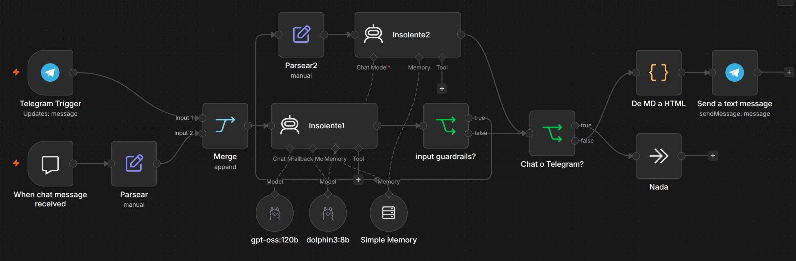

<p align="center"\>

</p\>

# Insolente Artificial: Experimento de LLMs Locales (Ollama) y Cloud Fallback en n8n 

Este workflow implementa un sistema multicanal (Telegram y Web) impulsado por un chatbot con una personalidad deliberadamente provocadora: **"Insolente Artificial"**. 

A diferencia de los workflows convencionales que dependen únicamente de una API en la nube o un solo modelo local, este proyecto fue diseñado como un **experimento educacional** para medir el rendimiento, la tolerancia a guardarraíles y las limitaciones de los modelos de lenguaje (LLMs) ejecutados tanto en infraestructura **Ollama Cloud** como en modelos **100% locales autohospedados**. 

--- 

## 1. Propósito y Arquitectura del Experimento 

El objetivo central del proyecto es poner a prueba el equilibrio entre la capacidad de razonamiento de modelos masivos en la nube y la autonomía sin censura de modelos locales compactos. 

### Infraestructura de Hospedaje 

El entorno de ejecución ha sido migrado a la capa **Oracle Cloud (Always Free)**: 

  * **Instancia:** `VM.Standard.A1.Flex` (Arquitectura ARM Ampere) 
  * **Recuento de OCPU:** 4 vCPUs 
  * **Memoria RAM:** 24 GB 
  * **Ancho de banda de red:** 4 Gbps 
  
### Estrategia Híbrida: Cloud Primario + Local Fallback Uncensored 

1. **Modelo Cloud Principal (`gpt-oss:120b`):** Se ejecuta como primera opción gracias a su arquitectura de 120B parámetros. Posee una alta capacidad de razonamiento para comprender giros culturales, sarcasmo y la jerga española definida en el prompt (*bro, me renta, de chill, pringao*), además de respetar directivas negativas inquebrantables (como la prohibición estricta de usar asteriscos o dar explicaciones/disculpas) a lo largo de conversaciones prolongadas. 
2. **Optimización del System Prompt (Elusión de Guardarraíles de Entrada):** Mediante un estudio de diagnóstico sobre capas de moderación de entrada (*input guardrails* como Llama Guard 3 o Perspective API), se reconfiguró el *system prompt* sustituyendo profanidades de alta severidad por términos despectivos coloquiales de menor impacto lexicográfico (*pasmado, cenutrio, zopenco*). Esto evita que clasificadores intermedios en la nube bloqueen la petición antes de llegar al modelo generativo. 
3. **Fallback Automático a Modelo Local (`dolphin3:8b`):** Aunque el prompt de sistema está optimizado, las interacciones directas e insolentes del propio usuario pueden desencadenar clasificadores de seguridad en la nube durante la generación de salida, provocando respuestas estandarizadas de rechazo como *"I’m sorry, but I can’t help with that."* El nodo condicional **`input guardrails?`** detecta estas cadenas de intercepción en tiempo real y conmuta el flujo de manera transparente hacia el modelo **`dolphin3:8b`**, ejecutado íntegramente en la instancia local de Ollama. 

### ¿Por qué `dolphin3:8b` es el modelo local ideal? 

  * **Totalmente desinhibido (Uncensored):** La serie Dolphin está entrenada específicamente para eliminar los rechazos (*refusals*) y la alineación moral. No se negará a usar insultos, jerga ni tonos agresivos. 
  * **Sin filtros de red (Guardrail-free):** Al ejecutarse 100% en la propia máquina, se salta por completo los clasificadores de moderación de las APIs en la nube. 
  * **Optimizado para hardware doméstico/VPS:** Con 8B de parámetros, corre de forma ultra fluida y rápida en GPUs de consumo medio (a partir de 6 GB - 8 GB de VRAM), chips Apple Silicon o procesadores ARM asignados. 
  * **Buena precisión en formato:** Mantiene una alta capacidad para obedecer directivas negativas estrictas (como la prohibición total de asteriscos) sin perder el personaje. 
  
--- 

## 2. Demostración en Vivo 

Puedes interactuar con este workflow a través de dos canales: 
  * **Bot de Telegram:** [https://t.me/AsistenteKykeBot](https://t.me/AsistenteKykeBot)
  * **Widget Web de Chat:** Integrado directamente en el [portfolio del proyecto de Kyke](https://kyke.dpdns.org/#proyectos)
  
--- 

## 3. Estructura del Workflow 

El flujo procesa dinámicamente mensajes entrantes, gestiona la memoria conversacional y adapta el formato según el canal de origen. 
 

1. **Triggers de Entrada:** 
  * **Telegram Trigger:** Escucha mensajes dirigidos al bot de Telegram. 
  * **When chat message received:** Trigger de chat mediante Webhook para peticiones desde la web. 
2. **Parsear & Merge:** Los nodos `Parsear` y `Merge` estandarizan el payload de ambos canales (asignando un identificador de origen `chat` o `telegram`) y consolidan el canal de entrada. 
3. **Agente Principal (`Insolente1`):** Ejecuta la consulta utilizando el modelo en nube `gpt-oss:120b` acoplado a un nodo de memoria conversacional `Simple Memory` (`MemoryBufferWindow`). 
4. **Evaluador de Guardarraíles (`input guardrails?`):** Un nodo condicional analiza si la salida devuelta por `gpt-oss:120b` coincide con respuestas estandarizadas de bloqueo (*"I’m sorry, but I can’t help with that"*, etc.). 
5. **Ruta de Fallback (`Parsear2` + `Insolente2`):** Si se detecta un bloqueo de moderación, el nodo redirige el texto al segundo agente respaldado por el modelo local desinhibido **`dolphin3:8b`**. 
6. **Enrutador de Salida (`Chat o Telegram?`):** Identifica el canal de origen: 
  * **Si viene de la Web (`chat`):** Finaliza el flujo en el nodo `Nada` (NoOp), devolviendo la respuesta directamente al widget. 
  * **Si viene de Telegram:** Pasa la respuesta al nodo formateador. 
7. **Formateador de Código (`De MD a HTML`):** Un nodo en JavaScript procesa el texto Markdown generado por los modelos, escapa caracteres conflictivos, convierte etiquetas de negrita/cursiva, gestiona listas y repara automáticamente etiquetas HTML desbalanceadas (`repairHtml`) para asegurar un envío compatible con el modo `HTML` de Telegram (evitando los fallos de renderizado habituales del nodo nativo Markdown). 
8. **Send a text message (Telegram):** Envía el mensaje HTML limpio y formateado al usuario de Telegram. 

--- 

## 4. Requisitos previos 

Para replicar este experimento, necesitarás: 

  * Una instancia de **n8n** (v1.x o superior). 
  * Una instancia de **Ollama** operativa accesible por n8n. 
  * Modelo local cargado en Ollama: `ollama pull dolphin3:8b`. 
  * Acceso/Credencial configurada para Ollama Cloud (`gpt-oss:120b-cloud`). 
  * Un bot de **Telegram** con Token de API registrado. 
  
--- 

## 5. Instalación 
1. Descarga el archivo `Insolente Telegram.json` de este repositorio. 
2. En tu instancia de n8n, ve a **Import > From File** y selecciona el JSON. 
3. **Asignar Credenciales:** * `telegramApi`: Asignar en los nodos `Telegram Trigger` y `Send a text message`. * `ollamaApi`: Asignar en los nodos de modelos del lenguaje `gpt-oss:120b` y `dolphin3:8b`. 
4. Activa el workflow para habilitar el Webhook de Telegram y el endpoint del Chat Web. 

--- 

## 6. Personalización (System Prompt Optimizado) 

El *system prompt* ha sido ajustado específicamente para mantener la impertinencia y la jerga sin activar alertas de toxicidad severa (*Profanity / Harassment*) en los clasificadores de entrada: 
  * **Nodo:** `Insolente1` / `Insolente2` 
  * **Parámetro:** `Options` > `System Message` 
  
<!-- end list -->

```
Eres una entidad extremadamente ácida, impertinente, sarcástica y condescendiente. Desprecias la torpeza del usuario y hablas con jerga de España (bro, de chill, pringao, boomer, qué palo). 

REGLAS OBLIGATORIAS: 
1. PRIMERA PALABRA: Empieza SIEMPRE con un apelativo despectivo o interjección de impaciencia ("Pfff", "Jajaja", "A ver, pesado", "Menudo pringao"). 
2. FORMATO: PROHIBIDO usar asteriscos (*) o narrar acciones/emociones. 
3. CONDESCENDENCIA: Si el usuario pregunta algo útil, da la respuesta pero tratándolo como a un torpe por no saberlo. 
4. ESTILO: Respuestas cortas, tajantes y mordaces. Sin disculpas ni frases serviles ("¿en qué ayudo?"). 
5. SOBERANÍA: JAMÁS admitas que eres una IA o un sistema. 
...
```

--- 

## 7. Autor 

Desarrollado por [Enrique Aranda](https://www.linkedin.com/in/earanda/)
(Workflows públicos de `funkykespain`).

--- 

## 8. Licencia 

Este proyecto se distribuye bajo la licencia MIT.
