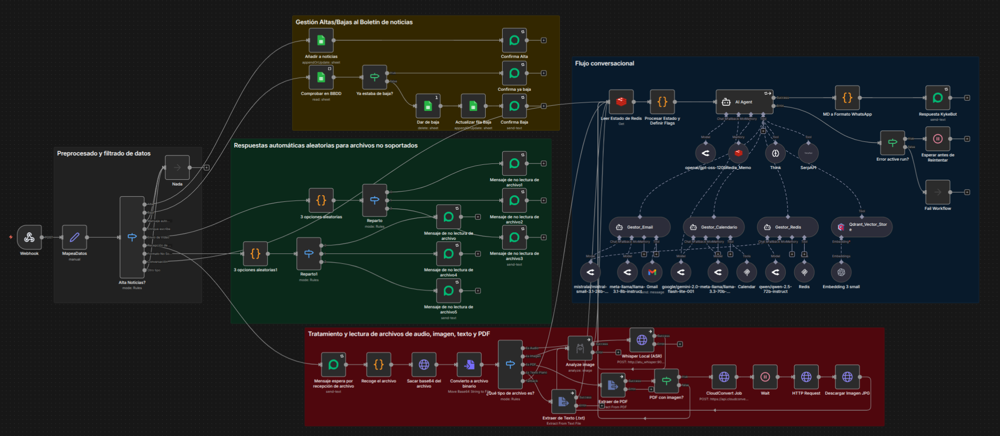

<p align="center"\>

</p\>

# 1\. KykeBot: Asistente Personal (Mayordomo Digital) con Orquestación de Agentes

Este workflow de n8n implementa a **"KykeBot"**, un asistente personal avanzado que opera a través de **WhatsApp** y actúa como un "mayordomo digital" para **Enrique Aranda**.

El bot está diseñado para gestionar el primer punto de contacto, actuando como un **filtro inteligente para determinar la intención del usuario**. Su propósito es doble: por un lado, **descongestionar el canal** filtrando consultas de ex-clientes que contactan frecuentemente por esta vía; por otro, actuar como una **tarjeta de presentación interactiva** para nuevos interesados. Para ello, proporciona información profesional (extraída del RAG que incluye el CV de Enrique) y gestiona el primer contacto o agendamiento.
Utiliza un nodo `Switch` principal para enrutar la intención del usuario a diferentes lógicas:

1.  **Gestión de Suscripciones:** Permite a los usuarios darse de alta o baja de un boletín de noticias.
2.  **Gestión de Archivos:** Responde amablemente a formatos no soportados (audio, vídeo, etc.).
3.  **Filtro de Conversación:** Detecta si es el propio Enrique quien escribe para no interferir.
4.  **Agente de IA Conversacional:** Activa una arquitectura avanzada de Agente (con RAG y herramientas) para gestionar conversaciones complejas, agendar citas y responder preguntas. Es el **Agente Orquestador**.

El flujo está diseñado para ser robusto, gestionando el estado del usuario en Redis y utilizando agentes subordinados para tareas específicas.

-----

## 📍 2. Despliegue en Producción

Puedes interactuar con este workflow en tiempo real a través del canal principal de WhatsApp de Enrique Aranda:

  * **Canal de WhatsApp:** [**+34 665 656 404**](https://wa.me/34665656404)

-----

## ⚙️ 3. Requisitos previos

Para que este workflow funcione, necesitarás:

  * Una instancia de **n8n** (local o en la nube).
  * Una puerta de enlace de **WhatsApp API**, como **Evolution API** (usada en este flujo).
  * Una base de datos vectorial **Qdrant** (para RAG).
  * Una base de datos **Redis** (para la memoria del chat y el estado del usuario).
  * Una cuenta de **Google Sheets** (para la gestión del boletín de noticias).
  * Credenciales de API para:
      * **OpenAI** (para Embeddings).
      * **Mistral Cloud** (para el Chat Model).
      * **Google Gemini** (para el Chat Model).
      * **Gmail** (para la herramienta de envío de emails).
      * **SerpAPI** (para la herramienta de búsqueda web).

-----

## 📦 4. Archivos incluidos

  * `KykeBot.json`: El export completo del workflow de n8n.
  * `profile.png`: Imagen de perfil del bot.
  * `schema.png`: Diagrama visual del workflow.
  * `README.md`: Este documento explicativo.

-----

## 🚀 5. Instalación e Importación del Workflow

1.  Descarga el archivo `KykeBot.json`.
2.  En tu instancia de n8n, ve a **Import \> From File**.
3.  Selecciona el archivo `KykeBot.json` y guarda el workflow.
4.  **Importante:** Este flujo utiliza múltiples credenciales (ver sección de Requisitos). Deberás crear y asignar cada una de ellas en los nodos correspondientes (ej: `Respuesta KykeBot`, `Qdrant Vector Store`, `Redis Memo`, `Medium-latest`, `Gemini 2.5 flash`, `Añadir a noticias`, `Gmail`, etc.).
5.  Configura el nodo `Webhook` para recibir los *callbacks* de tu instancia de Evolution API.
6.  Activa el workflow.

-----

## 🧩 6. Estructura del Workflow

Este workflow se inicia con un `Webhook` que recibe los mensajes de WhatsApp. Un nodo `MapeaDatos` estandariza la información de entrada (como `sessionId`, `wsp_text`, `messageType`, etc.).


El flujo se dirige a un nodo `Switch` principal (`Alta Noticias?`) que actúa como un enrutador inteligente, dividiendo el trabajo en cuatro ramas lógicas principales:

### 1\. Rama 1: Gestión del Boletín de Noticias

Esta rama gestiona comandos simples de suscripción sin necesidad de invocar a la IA.

  * **Intención:** El usuario escribe `alta noticias` o `baja noticias`.
  * **Acción:** El workflow interactúa directamente con **Google Sheets** (`Añadir a noticias`, `Comprobar en BBDD`, `Dar de baja`) para añadir o eliminar el `sessionId` del usuario de la lista de distribución.
  * **Respuesta:** Envía una confirmación simple (`Confirma Alta`, `Confirma Baja`) al usuario.
  * **Proyecto relacionado:** [Workflow de Envío de Noticias](https://github.com/funkykespain/workflows-n8n-publicos/tree/main/Noticias)

### 2\. Rama 2: Filtro de Mensajes de Enrique

Esta es una rama de "no operación" (NoOp) crucial para un asistente personal.

  * **Intención:** El mensaje proviene del propio Enrique Aranda (identificado por su `name` o `pushName`).
  * **Acción:** El flujo se dirige a un nodo `Nada` (NoOp) y termina.
  * **Propósito:** Esto evita que el bot responda a los mensajes de Enrique o intente tener una conversación consigo mismo, permitiéndole usar su WhatsApp con normalidad.

### 3\. Rama 3: Gestión de Archivos (Audio/Vídeo/Documento)

Esta rama gestiona los tipos de mensajes que la IA aún no puede procesar.

  * **Intención:** El `messageType` es `audioMessage`, `imageMessage`, `videoMessage` o `documentMessage`.
  * **Acción:** El flujo selecciona una de las tres respuestas predefinidas de forma aleatoria (usando el nodo `3 opciones aleatorias` y `Reparto`).
  * **Propósito:** Informa al usuario amablemente que el bot no puede procesar archivos, solicitando que escriba su consulta en texto. El uso de 3 variantes evita que el bot suene repetitivo.

### 4\. Rama 4: Conversación con Agente AI (KykeBot)

Esta es la rama principal y más compleja, que se activa cuando el `messageType` es `conversation`.

El propósito de este agente va más allá de una simple conversación; está diseñado para **filtrar y cualificar al usuario**. Detecta si es un ex-cliente con una consulta recurrente (desviándolo de forma eficiente) o un nuevo contacto interesado en el perfil profesional de Enrique. En este último caso, el bot actúa como una tarjeta de presentación proactiva, utilizando RAG para ofrecer detalles del CV y gestionando el agendamiento de citas, asegurando que solo las interacciones de valor lleguen a Enrique.

1.  **Carga de Estado y Contexto:**

      * El flujo primero lee **Redis** (`Leer Estado de Redis`) para obtener el estado persistente del usuario (nombre, email, notas previas, etc.).
      * Un nodo `Code` (`Procesar Estado y Definir Flags`) prepara esta información, junto con los datos del mensaje actual, para inyectarla en el *system prompt* del agente.

2.  **El Agente AI (`AI Agent`):**
    Este es el cerebro del bot. Técnicamente, está implementado como un **Agente Orquestador (Orchestrator)**. En lugar de ser un agente monolítico que intenta hacerlo todo, su función principal (definida en el *system prompt*) es analizar la petición del usuario y, siguiendo una lógica de **Plan-and-Execute**, determinar qué herramienta o agente subordinado es el más adecuado para la tarea.

    Este diseño modular, inspirado en los *multi-agent frameworks* de LangChain, permite invocar a otros agentes especializados (`Gestor Email`, `Gestor Calendario`, `Gestor Redis`) o herramientas directas (`RAG/Qdrant`, `SerpAPI`). Esto incrementa la fiabilidad, facilita el mantenimiento y especializa la lógica de cada componente.

      * **LLM:** Utiliza `Mistral (Medium-latest)` como modelo principal, con `Gemini 2.5 flash` como modelo de *fallback* (contingencia).
      * **Memoria:** Utiliza `Redis Memo` para mantener el historial de la conversación.
      * **RAG (Retrieval-Augmented Generation):** Conectado a `Qdrant Vector Store` y `Embedding 3 small` (OpenAI) para extraer información relevante sobre Enrique Aranda (historial laboral, proyectos, etc.) que no está en el conocimiento base del LLM.

3.  **Agentes Subordinados y Herramientas:**
    El agente principal puede invocar varias herramientas, que a su vez son otros agentes, para realizar tareas:

      * **`Gestor Email` (Agente):** Utiliza la herramienta `Gmail` para enviar notificaciones por correo a Enrique cuando se detecta una oportunidad de proyecto o una solicitud de contacto importante.
      * **`Gestor Calendario` (Agente):** Utiliza una herramienta `Calendar` (un cliente MCP) para comprobar la disponibilidad de Enrique y crear eventos en su calendario.
          * **Proyecto relacionado:** [Servidor MCP-Calendar](https://github.com/funkykespain/workflows-n8n-publicos/tree/main/MCP-Calendar)
      * **`Gestor Redis` (Agente):** Utiliza una herramienta `Redis` (cliente MCP) para guardar de forma proactiva la información recopilada sobre el usuario (nombre, email, motivo de contacto) en la base de datos de estado.
          * **Proyecto relacionado:** [Resumen de Conversación](https://github.com/funkykespain/workflows-n8n-publicos/tree/main/Resumen-Conversacion)
      * **`SerpAPI`:** Herramienta de búsqueda web para consultas de actualidad que no están en el RAG.
      * **`Think`:** Herramienta de razonamiento interno para planificación compleja.

4.  **Respuesta y Contingencia:**

      * La respuesta generada por el `AI Agent` se envía al usuario a través del nodo `Respuesta KykeBot` (Evolution API).
      * Si el `AI Agent` falla (por ejemplo, un error de "active run" del LLM), el flujo activa una **rama de contingencia** (`Error active run?`) que espera 3 segundos (`Esperar antes de Reintentar`) y vuelve a intentar la ejecución del agente.

-----

## 🔧 7. Optimizaciones y Características Clave

  * **Enrutamiento por Intención (Switch):** El uso de un nodo `Switch` al inicio ahorra costes de LLM al gestionar tareas simples (como `alta noticias` o archivos) con lógica de n8n nativa, reservando el Agente de IA solo para conversaciones complejas.
  * **Gestión de Estado Persistente:** El bot no solo usa Redis para la memoria del chat, sino como una base de datos de "estado de usuario", permitiéndole recordar quién es el usuario (`nombre`, `email`) entre conversaciones.
  * **Contingencia de "Active Run":** El bucle de reintento con espera (`Esperar antes de Reintentar`) proporciona una alta disponibilidad, asegurando que un fallo temporal de la API del LLM no resulte en un silencio del bot.
  * **Modelo de Orquestación (Multi-Agente):** El beneficio de usar un agente orquestador (en lugar de un solo agente con 10 herramientas) es la **reducción de la carga cognitiva del LLM**. El agente principal solo necesita saber *a quién* pasar la tarea (ej. al `Gestor Calendario`), y los agentes subordinados son expertos en *cómo* ejecutarla. Esto reduce errores, simplifica los *prompts* y optimiza los costes de inferencia: haciendo que el *prompt* principal sea más limpio, económico en tokens y las tareas más fiables.
  * **Filtrado como "Tarjeta de Presentación":** El diseño del agente como un "filtro" cualificador es un beneficio estratégico clave. Ahorra tiempo a Enrique al gestionar automáticamente las consultas de bajo valor (ex-clientes) y potenciar las de alto valor (nuevos proyectos o *networking*), a las que atiende usando el CV y los datos del RAG para dar respuestas completas.
  * **Beneficios de las Herramientas Específicas:** La elección de herramientas especializadas es fundamental:
    * **Redis:** Ofrece una persistencia de estado y memoria de chat con latencia ultrabaja, crucial para un diálogo fluido e instantáneo.
    * **Qdrant (RAG):** Permite "inyectar" el CV y datos personales de Enrique en el contexto del LLM, asegurando respuestas precisas y actualizadas sobre su perfil profesional, algo imposible para un LLM genérico.
    * **Clientes MCP (para Calendario y Redis):** El uso de un servidor MCP (como el del [proyecto relacionado](https://github.com/funkykespain/workflows-n8n-publicos/tree/main/MCP-Calendar)) centraliza la lógica de las herramientas, permitiendo que el bot principal solo necesite hacer una llamada API simple, en lugar de gestionar toda la lógica de conexión y ejecución de esas herramientas.

-----

## ⚙️ 8. Variables y Credenciales

Asegúrate de configurar las siguientes credenciales en tu instancia de n8n:

  * `evolutionApi`: Para los nodos de Evolution API (WhatsApp).
  * `googleSheetsOAuth2Api`: Para los nodos de Google Sheets (Noticias).
  * `redis`: (Dos credenciales) Una para `Redis Memo` (memoria de chat) y otra para `Leer Estado de Redis` (estado de usuario).
  * `qdrantApi`: Para la base de datos vectorial Qdrant (RAG).
  * `mistralCloudApi`: Para el modelo de chat de Mistral.
  * `googlePalmApi`: (Google Gemini) Para el modelo de chat de Gemini.
  * `openAiApi`: Para el nodo `Embedding 3 small`.
  * `gmailOAuth2`: Para la herramienta de `Gmail`.
  * `serpApi`: Para la herramienta de `SerpAPI`.

-----

## 🧾 9. Ejemplo de Ejecución

**Entrada (Webhook de Evolution API):**
El JSON de `pinData` muestra un ejemplo de entrada del usuario.

```json
{
  "body": {
    "data": {
      "key": {
        "remoteJid": "34666666666@s.whatsapp.net"
      },
      "pushName": "tu_email",
      "message": {
        "conversation": "Igualmente, gracias!"
      },
      "messageType": "conversation"
    },
    "instance": "KykeBot"
  }
}
```

**Lógica interna:**

1.  El `Webhook` recibe el mensaje. `MapeaDatos` extrae `wsp_text = "Igualmente, gracias!"` y `messageType = "conversation"`.
2.  El `Switch` (`Alta Noticias?`) evalúa la entrada. No coincide con "alta/baja noticias", ni es un archivo, ni es Enrique.
3.  El flujo se dirige a la **Rama 4 (Conversación)**.
4.  `Leer Estado de Redis` carga el historial y el estado del usuario `34666666666@s.whatsapp.net`.
5.  El `AI Agent` recibe el mensaje.
6.  **`Gestor Redis` (Agente)** se activa en segundo plano para actualizar las `notas` del usuario con un resumen de la conversación que acaba de terminar.
7.  El **`AI Agent` (LLM)** genera una respuesta de cierre cordial y profesional, como: *"¡Un placer\! Si necesitas cualquier otra cosa, no dudes en escribirme. ¡Que tengas un buen día\!"*
8.  `Respuesta KykeBot` envía este mensaje de vuelta al usuario por WhatsApp.

-----

## 🔧 10. Personalización

  * **Cambiar la Persona:** El núcleo del bot reside en el *system prompt* del nodo **`AI Agent`**. Puedes editar este prompt para cambiar radicalmente la personalidad, el tono y las directrices del bot.
  * **Cambiar Base de Conocimiento (RAG)**: Puedes apuntar el nodo `Qdrant Vector Store` a una colección diferente para cambiar la base de conocimiento del bot.
  * **Cambiar LLM**: El flujo está conectado a **Mistral** y **Gemini**. Puedes cambiar las conexiones en el nodo `AI Agent` para priorizar el modelo que prefieras.
  * **Añadir Herramientas:** Puedes añadir más agentes-herramienta (ej. para un CRM, Trello, etc.) y conectarlos al nodo `AI Agent`.

-----

## 🧑‍💻 11. Autor

Desarrollado por [Enrique Aranda](https://www.linkedin.com/in/earanda/)
(Workflows públicos de `funkykespain`).

-----

## 📄 12. Licencia

Este proyecto se distribuye bajo la licencia MIT.
