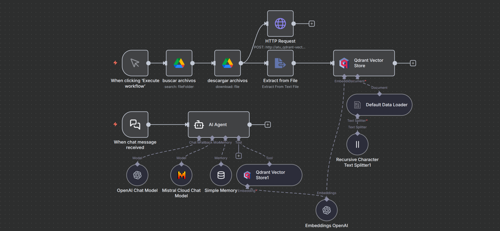

<p align="center"\>

</p\>

# 🧠 1. Lyra: Agente de IA para Optimización de Prompts (RAG)

Este workflow de n8n implementa a **"Lyra"**, una agente de IA experta diseñada para analizar, depurar y optimizar *system prompts* y entradas de usuario.

El bot, accesible a través de un **chat web**, utiliza una arquitectura de Agente de IA con RAG (Retrieval-Augmented Generation). Su objetivo es transformar solicitudes vagas en prompts precisos y de alto impacto. Para lograrlo, consulta una base de conocimiento vectorial interna (alimentada desde Google Drive) sobre ingeniería de prompts y aplica metodologías avanzadas (como la 4-D: Deconstruir, Diagnosticar, Desarrollar, Entregar) para mejorar cualquier solicitud.

Este proyecto fue creado para experimentación educacional y como herramienta de trabajo interna para mejorar los prompts de sistema en proyectos de IA en la empresa **Universitas Hub**, como ejemplo de cómo se aplica la **ingeniería de prompts** y las **metodologías estructuradas (4-D)** en un entorno de trabajo real.

-----

## 📍 2. Despliegue en Producción

Puedes interactuar con este workflow en tiempo real en el siguiente enlace:

  * **Chat Web (Webhook):** [Chat con Lyra en Universitas Hub](https://univers.universitashub.com/webhook/582b0ee0-a9cf-4882-8e07-54a00828c12a/chat)

-----

## ⚙️ 3. Requisitos previos

Para que este workflow funcione, necesitarás:

  * Una instancia de **n8n** (local o en la nube).
  * Una base de datos vectorial **Qdrant** (local o en la nube).
  * Una cuenta de **Google Drive** con una carpeta que contenga los documentos de la base de conocimiento.
  * Credenciales de API para:
      * **OpenAI** (para Embeddings y Chat Model).
      * **Mistral Cloud** (para Chat Model).

-----

## 📦 4. Archivos incluidos

  * `Lyra.json`: El export completo del workflow de n8n.
  * `profile.png`: Imagen de perfil del bot.
  * `schema.png`: Diagrama visual del workflow.
  * `Prompt Engineering_ Artículos Científicos.md`: Archivo de ejemplo para la base de conocimiento RAG.
  * `47 prompts para generar prompts de ventas.md`: Archivo de ejemplo para la base de conocimiento RAG.
  * `Mejora_de_ingenieria_de_prompts_científicos.md`: Archivo de ejemplo para la base de conocimiento RAG.
  * `README.md`: Este documento explicativo.

-----

## 🚀 5. Instalación e Importación del Workflow

1.  Descarga el archivo `Lyra.json`.
2.  En tu instancia de n8n, ve a **Import \> From File**.
3.  Selecciona el archivo `Lyra.json` y guarda el workflow.
4.  **Importante:** Este flujo utiliza 4 tipos de credenciales (ver sección de Requisitos). Deberás crear y asignar cada una de ellas en los nodos correspondientes:
      * `Qdrant Vector Store` y `Qdrant Vector Store1`
      * `buscar archivos` y `descargar archivos` (Google Drive)
      * `Embeddings OpenAI` y `OpenAI Chat Model`
      * `Mistral Cloud Chat Model`
5.  Revisa el nodo `buscar archivos` (Google Drive) para establecer el ID de la carpeta que contiene tus documentos de RAG.
6.  Activa el workflow. El *trigger* de chat se registrará automáticamente.

-----

## 🧩 6. Estructura del Workflow

Este workflow se divide en dos lógicas principales, tal y como se ve en el diagrama:


### 1\. Lógica de Chatbot (Recepción y Respuesta)

Es la rama principal (inferior) que se activa con un mensaje de chat.

1.  **Trigger (`When chat message received`)**: El flujo se activa mediante un *Chat Trigger* (webhook) público, diseñado para ser incrustado en un sitio web.

2.  **Agente (`AI Agent`)**: Este es el cerebro de "Lyra". Es un nodo de Agente de IA configurado con un *system prompt* muy detallado.

      * **Personalidad:** "Lyra, una especialista en optimización de prompts de IA de nivel maestro".
      * **Metodología:** Sigue un marco analítico estricto de 4-D (Deconstruir, Diagnosticar, Desarrollar, Entregar) para cada solicitud.
      * **Modos de Operación:** Puede operar en `MODO DETALLADO` (haciendo preguntas aclaratorias) o `MODO BÁSICO` (optimización rápida).
      * **Técnicas:** El prompt instruye al agente sobre el uso de técnicas avanzadas como CoT, ToT, RAG, ReAct, etc., al formular sus respuestas.

3.  **Modelos (`OpenAI Chat Model`, `Mistral Cloud Chat Model`)**: El agente está conectado a dos modelos de lenguaje (`gpt-4.1-mini` y `mistral-small-latest`). Esto se usa para **robustez y contingencia (fallback)**; si un modelo falla, el agente intentará automáticamente con el otro.

4.  **Memoria (`Simple Memory`)**: Utiliza un nodo `memoryBufferWindow` para mantener un historial de las últimas 20 interacciones, permitiendo a Lyra tener conversaciones con contexto.

5.  **Herramienta RAG (`Qdrant Vector Store1`)**: Esta es la única herramienta del agente.

      * **Modo:** `retrieve-as-tool`.
      * **Función:** Cuando Lyra necesita información sobre una técnica de prompting específica, utiliza esta herramienta para buscar en la colección `prompty` de Qdrant.
      * **Descripción de la Herramienta:** "Llama a esta tool siempre para recoger información sobre cómo hacer mejor un prompt, optimizarlo o utilizar alguna técnica específica."

### 2\. Lógica de Indexación (Alimentación de RAG)

Es la rama secundaria (superior) que se activa manualmente para (re)construir la base de conocimiento vectorial.

1.  **Trigger (`When clicking ‘Execute workflow’`)**: Se ejecuta manualmente para actualizar la base de conocimiento.

2.  **Google Drive (`buscar archivos`, `descargar archivos`)**: Busca y descarga todos los archivos de una carpeta específica de Google Drive (en este caso, los archivos `.md` sobre ingeniería de prompts).

3.  **Limpieza de Vectores (`HTTP Request`)**: Antes de añadir nuevos datos, este nodo envía una solicitud `POST` directa a la API de Qdrant (`.../points/delete`) para **eliminar todos los vectores existentes** que coincidan con el `metadata.tipo` del archivo que se va a indexar. Esto previene la duplicación de datos y asegura que la base de conocimiento esté siempre actualizada con la última versión de los documentos.

4.  **Procesamiento y Chunking (`Extract from File`, `Recursive Character Text Splitter1`)**: Extrae el texto de los archivos y lo divide en fragmentos (chunks) de 400 caracteres con un solapamiento (overlap) de 100, optimizado para la ingesta de RAG.

5.  **Embeddings y Carga (`Embeddings OpenAI`, `Qdrant Vector Store`)**:

      * El nodo `Embeddings OpenAI` genera los vectores para cada fragmento de texto.
      * El nodo `Qdrant Vector Store` (en modo `insert`) almacena estos vectores en la colección `prompty` de Qdrant, listos para ser consultados por el agente.

-----

## 🔧 7. Optimizaciones Adicionales

  * **Embeddings Compartidos:** El nodo `Embeddings OpenAI` es un único recurso compartido. Se utiliza tanto en la **Lógica de Indexación** (para crear los vectores) como en la **Lógica de Chatbot** (para *vectorizar* la consulta del usuario antes de buscar en Qdrant). Esto asegura una consistencia matemática total entre los vectores almacenados y los vectores de búsqueda.
  * **Modelos de Contingencia (Fallback):** El agente `AI Agent` está configurado con dos LLMs (OpenAI y Mistral). Si la API del modelo primario falla, el workflow automáticamente usará el secundario, garantizando una alta disponibilidad del bot.
  * **Mantenimiento de RAG Automatizado:** El uso del nodo `HTTP Request` para eliminar vectores antiguos antes de la indexación es una optimización clave. Asegura que la base de conocimiento no acumule datos obsoletos y que las actualizaciones de los documentos en Google Drive se reflejen limpiamente en Qdrant tras cada ejecución manual.

-----

## ⚙️ 8. Variables y Credenciales

Asegúrate de configurar las siguientes credenciales en tu instancia de n8n:

  * `qdrantApi`: Para la base de datos vectorial Qdrant.
  * `googleDriveOAuth2Api`: Para leer documentos de Google Drive.
  * `openAiApi`: Para embeddings y el modelo de chat.
  * `mistralCloudApi`: Para el modelo de chat de contingencia.

-----

## 🧾 9. Ejemplo de Ejecución

**Entrada (Usuario en el Chat Web):**
`BÁSICO usando ChatGPT — Necesito un prompt para generar descripciones de producto para mi e-commerce.`

**Lógica interna:**

1.  **Agente Lyra** recibe la solicitud. Reconoce el modo `BÁSICO` y el objetivo `ChatGPT`.
2.  El agente decide que, para dar la mejor respuesta, debe consultar su base de conocimiento sobre "prompts para e-commerce" o "descripciones de producto".
3.  Activa su herramienta **RAG (`Qdrant Vector Store1`)** con una consulta vectorizada de "técnicas de prompt para descripciones de e-commerce".
4.  Qdrant devuelve fragmentos relevantes de los archivos `.md`, como "Incluir la persona (cliente ideal)" o "Usar la fórmula AIDA".
5.  El agente Lyra combina esta información (el contexto RAG) con su *system prompt* (la Metodología 4-D) para construir una respuesta optimizada.
6.  Lyra genera la respuesta final en Markdown.

**Salida esperada (Respuesta de Lyra):**

**Tu Prompt Optimizado:**

```markdown
Como experto en redacción publicitaria de e-commerce y especialista en la fórmula AIDA, tu tarea es generar 5 descripciones de producto únicas y persuasivas para [Nombre del Producto].

**Rol:** Experto en E-commerce.
**Contexto:** El producto es [Breve descripción del producto, 1-2 frases]. El público objetivo es [Cliente ideal, ej: "jóvenes profesionales interesados en la sostenibilidad"]. El tono debe ser [Tono, ej: "entusiasta y profesional"].

**Tarea:** Escribe una descripción que siga esta estructura:
1.  **Atención (A):** Una frase inicial o pregunta que capte el interés.
2.  **Interés (I):** Destaca 1-2 beneficios clave o características únicas.
3.  **Deseo (D):** Explica cómo el producto resuelve un problema o mejora la vida del cliente.
4.  **Acción (A):** Un llamado a la acción claro (ej: "¡Añádelo a tu carrito ahora!").

**Restricciones:**
- No más de 100 palabras por descripción.
- Evita clichés como "calidad inmejorable".
- Incluye la palabra clave: [Palabra Clave SEO].
```

**Cambios Clave:** He aplicado la **Metodología 4-D (Desarrollo)**:

  * **Asignación de Rol:** Se asignó un rol de "Experto en E-commerce" para enfocar al modelo.
  * **Contexto Estructurado:** Se añadieron marcadores de posición claros (`[Producto]`, `[Público]`) para que puedas reutilizarlo fácilmente.
  * **Descomposición de Tareas:** Se especificó la fórmula AIDA, descomponiendo la tarea compleja de "escribir una descripción" en un formato estructurado que el LLM puede seguir fácilmente.

-----

## 🔧 10. Personalización

  * **Cambiar la Persona:** El núcleo de Lyra reside en el *system prompt* del nodo **`AI Agent`**. Puedes editar este prompt para cambiar radicalmente su personalidad, metodología y reglas.
  * **Cambiar Base de Conocimiento**: Modifica el ID de la carpeta en el nodo de Google Drive **`buscar archivos`** para apuntar a tus propios documentos. Ejecuta la rama de indexación manual para poblar Qdrant con tu propio conocimiento.
  * **Cambiar LLM**: El flujo está conectado a **OpenAI** y **Mistral**. Puedes cambiar las conexiones en el nodo `AI Agent` para priorizar el modelo que prefieras o añadir otros compatibles.

-----

## 🧑‍💻 11. Autor

Desarrollado por [Enrique Aranda](https://www.linkedin.com/in/earanda/)
(Workflows públicos de `funkykespain`).

-----

## 📄 12. Licencia

Este proyecto se distribuye bajo la licencia MIT.
