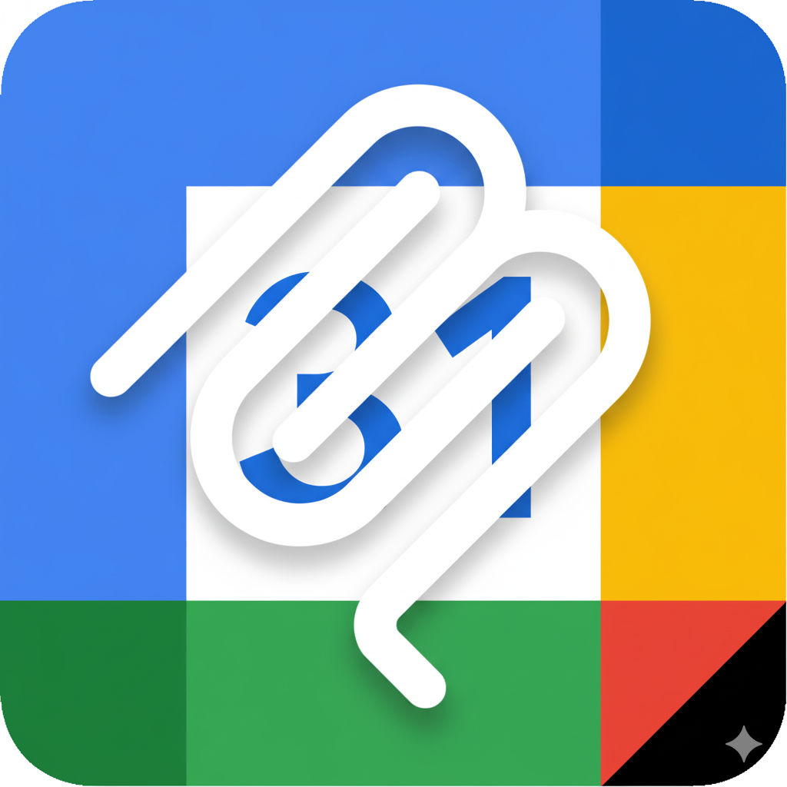
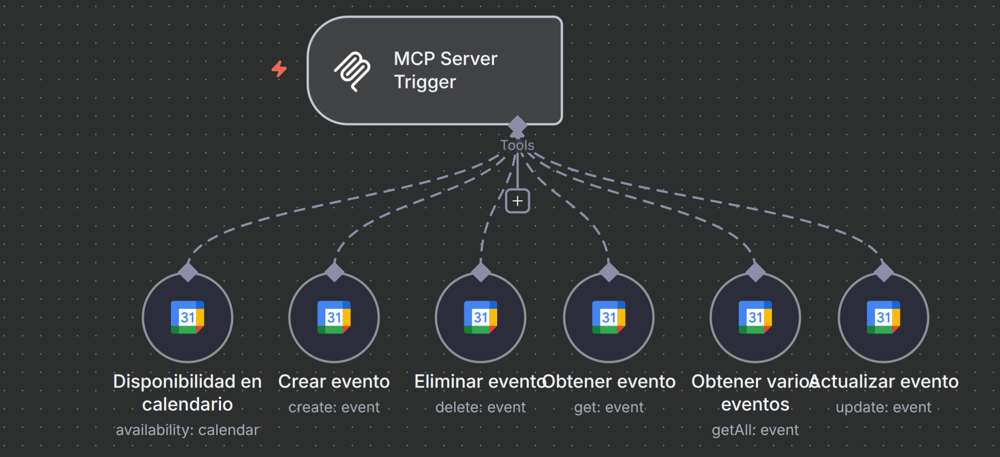

</p\>

# 🗓️ 1. MCP-Calendar: Servidor de Herramientas de Google Calendar

Este workflow de n8n implementa un **servidor de herramientas** (Tool Server) especializado en gestionar operaciones de **Google Calendar**. Está construido sobre el nodo `MCP Server Trigger` (Multi-Agent Control Plane) de n8n.

Su propósito no es actuar como un chatbot independiente, sino **servir como un micro-servicio** al que otros agentes de IA (como [KykeBot](https://github.com/funkykespain/workflows-n8n-publicos/tree/main/KykeBot)) pueden llamar para delegar tareas de calendario.

El workflow expone 6 herramientas clave de Google Calendar, permitiendo a un agente subordinado crear, eliminar, buscar y modificar eventos.

-----

## 📍 2. Propósito y Contexto

Este workflow es una herramienta de soporte para [KykeBot](https://github.com/funkykespain/workflows-n8n-publicos/tree/main/KykeBot).

En una arquitectura de agentes moderna, es una buena práctica externalizar conjuntos de herramientas específicas. En lugar de sobrecargar al agente principal (KykeBot) con 6 herramientas de calendario y sus prompts, se crea el "micro-agente" subordinado `Gestor Calendario` (el cual tiene un MCP Client Tool node que llama a este servidor MCP-Calendar) que se especializa únicamente en eso.

KykeBot simplemente sabe que para cualquier cosa relacionada con "calendario", debe llamar a este workflow.

-----

## ⚙️ 3. Requisitos previos

Para que este workflow funcione, necesitarás:

* Una instancia de **n8n** (local o en la nube).
* Credenciales de API para **Google Calendar** (OAuth2).

-----

## 📦 4. Archivos incluidos

  * `Calendar.json`: El export completo del workflow de n8n.
  * `profile.png`: Imagen de perfil del workflow (Icono de Google Calendar).
  * `schema.png`: Diagrama visual del workflow.
  * `README.md`: Este documento explicativo.

-----

## 🚀 5. Instalación e Importación del Workflow

1.  Descarga el archivo `Calendar.json`.
2.  En tu instancia de n8n, ve a **Import \> From File**.
3.  Selecciona el archivo `Calendar.json` y guarda el workflow.
4.  **Importante (Credenciales):** Este flujo requiere 1 tipo de credencial: `googleCalendarOAuth2Api`. Deberás crearla en tu instancia de n8n y asignarla a los 6 nodos de Google Calendar (`Crear evento`, `Eliminar evento`, etc.).
5.  **Importante (Configuración):** Deberás editar los nodos de Google Calendar para que apunten a **tu propio ID de calendario** (ver sección 10. Personalización).
6.  Activa el workflow. El `MCP Server Trigger` se registrará automáticamente y escuchará en la ruta definida (por defecto: `calendar-perso`).

-----

## 🧩 6. Estructura del Workflow

Este workflow es un servidor MCP de herramientas de Google Calendar. Su estructura es simple: un *trigger* que expone múltiples herramientas conectadas.

### 1\. Trigger (MCP Server Trigger)

  * **Nodo:** `MCP Server Trigger`
  * **Tipo:** `@n8n/n8n-nodes-langchain.mcpTrigger`
  * **Propósito:** Es el punto de entrada del workflow. A diferencia de un webhook normal, este *trigger* está diseñado para comunicarse con otros agentes de n8n (como `Gestor Calendario`).
  * **Path:** Por defecto, escucha en la URL `/calendar-perso`. Cuando un agente subordinado llama a esta ruta, el *trigger* le responde "Hola, tengo estas 6 herramientas disponibles para ti".

### 2\. Herramientas (Google Calendar Tools)

Los 6 nodos siguientes no se ejecutan secuencialmente. En su lugar, todos están conectados al *trigger* como **"Tools"** (Herramientas). El agente que llama a este workflow decidirá cuál de ellas utilizar en función de la petición del usuario.

Las herramientas expuestas son:

1.  **`Disponibilidad en calendario` (availability: calendar):** Comprueba la disponibilidad (libre/ocupado) en un rango de tiempo.
2.  **`Crear evento` (create: event):** Añade un nuevo evento al calendario.
3.  **`Eliminar evento` (delete: event):** Borra un evento existente usando su ID.
4.  **`Obtener evento` (get: event):** Recupera los detalles de un evento específico usando su ID.
5.  **`Obtener varios eventos` (getAll: event):** Lista todos los eventos dentro de un rango de fechas.
6.  **`Actualizar evento` (update: event):** Modifica un evento existente.

-----

## 🔧 7. Notas de Diseño (MCP)

### ¿Qué es MCP (Multi-Agent Control Plane)?

Este workflow utiliza el `MCP Server Trigger` de n8n, que es una implementación del concepto "Multi-Agent Control Plane".

> **En resumen:** En lugar de construir un único "super-agente" monolítico que lo sabe hacer todo (charlar, buscar en la web, usar RAG, gestionar calendario, enviar emails...), puedes construir múltiples "agentes-herramienta" más pequeños y especializados.

  * **KykeBot (Agente Principal):** Gestiona la conversación con el usuario.
  * **Gestor Calendario (Agente Intermedio):** Es un sub-agente de KykeBot (que usa un nodo `MCP Client Tool`) cuya única misión es saber cómo comunicarse con el servidor de calendario.
  * **MCP-Calendar (Este Workflow):** Es el servidor final. No habla, no piensa; simplemente recibe una orden (ej. "crear evento") y la ejecuta.

Cuando un usuario le dice a KykeBot: *"Añade una reunión con Juan mañana a las 10"*:

1.  **KykeBot** entiende la intención y sabe que debe usar a su `Gestor Calendario`.
2.  Llama al `Gestor Calendario` pasándole la intención (ej. "crear evento") y los datos (Resumen: "Reunión con Juan", Inicio: "mañana a las 10").
3.  El `Gestor Calendario` (usando su nodo `MCP Client`) llama a **este workflow** (MCP-Calendar).
4.  Este workflow ejecuta la acción en Google Calendar y devuelve el resultado (ej: "Evento creado con ID: xyz123") al `Gestor Calendario`.
5.  El `Gestor Calendario` devuelve ese resultado a **KykeBot**, quien finalmente formula una respuesta amable para el usuario.

-----

## ⚙️ 8. Credenciales

Asegúrate de configurar la siguiente credencial en tu instancia de n8n:

  * `googleCalendarOAuth2Api`: Credencial de OAuth2 para Google Calendar. Debe asignarse a los 6 nodos de herramienta.

-----

## 🧾 9. Ejemplo de Ejecución (Lógica)

Este workflow no se puede ejecutar directamente por un usuario, sino que es llamado por otro agente.

1.  **Petición del Agente Principal (KykeBot):**

      * KykeBot recibe un prompt: `"¿Tengo algo el viernes por la mañana?"`
      * El LLM de KykeBot determina que necesita usar la herramienta de calendario para "obtener varios eventos".
      * KykeBot consulta a Gestor Calendario que a su vez llama a este servidor (MCP-Calendar) solicitando usar la herramienta `Obtener varios eventos` y pasa los parámetros que ha inferido (ej: `timeMin: [fecha_viernes_08:00]`, `timeMax: [fecha_viernes_14:00]`).

2.  **Ejecución en MCP-Calendar:**

      * El `MCP Server Trigger` recibe la llamada.
      * El nodo `Obtener varios eventos` se activa con los parámetros recibidos.
      * El nodo consulta la API de Google Calendar y obtiene una lista de eventos.

3.  **Respuesta (al Agente Principal):**

      * Este workflow devuelve un JSON con la lista de eventos (ej: `[{summary: 'Reunión equipo', start: '...'}, {...}]`) a Gestor Calendario.
      * KykeBot recibe este JSON desde Gestor Calendario, lo procesa con su LLM y genera una respuesta en lenguaje natural para el usuario final (ej: "¡Sí\! El viernes a las 10:00 tienes 'Reunión equipo'.").

-----

## 🔧 10. Personalización (¡Importante\!)

Para que este workflow funcione en tu entorno, **debes** modificar los 6 nodos de herramienta de Google Calendar:

1.  **Cambiar ID del Calendario:** Todos los nodos (excepto "Disponibilidad") tienen un campo `calendar` con un ID de calendario específico (ej: `a9710d8f...@group.calendar.google.com`). Debes reemplazarlo por el ID de tu propio calendario de Google.

2.  **Cambiar Email de Disponibilidad:** El nodo `Disponibilidad en calendario` tiene un campo `calendar` con un email (ej: `tu_email@gmail.com`). Debes reemplazarlo por el email principal de la cuenta de calendario que quieres consultar.

3.  **Cambiar Zona Horaria:** Todos los nodos que manejan fechas (como `Obtener varios eventos`) están configurados con `options.timeZone: "Europe/Madrid"`. Ajústalo a tu zona horaria local.

-----

## 🧑‍💻 11. Autor

Desarrollado por [Enrique Aranda](https://www.linkedin.com/in/earanda/)
(Workflows públicos de `funkykespain`).

-----

## 📄 12. Licencia

Este proyecto se distribuye bajo la licencia MIT.
