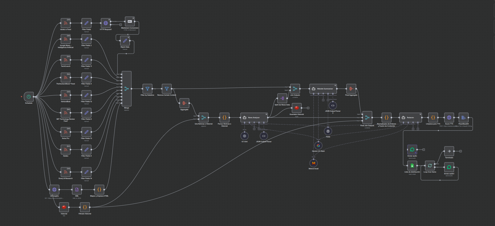

</p\>

# 1\. Boletín de Audio: Tu Dosis Diaria de IA y Tech

Este workflow de n8n es un sistema de curación y generación de contenido totalmente automatizado. Su objetivo es resolver la sobrecarga de información tecnológica (especialmente en IA y ciencia de datos) y entregar un resumen de audio conciso y de alta calidad directamente por WhatsApp.

Cada madrugada, el flujo se activa, procesa noticias de decenas de fuentes tecnológicas de prestigio (como *MIT Technology Review*, *Xataka*, *The Hacker News*, etc.), y filtra el ruido (opiniones, rumores, duplicados) para quedarse solo con lo relevante.

Posteriormente, una **orquesta de tres Agentes de IA** colabora:

1.  Un **Analista** selecciona las 15 noticias más importantes del día, comparándolas con un historial de 7 días para evitar repeticiones.
2.  Un **Summarizer** lee y resume cada una de esas 15 noticias.
3.  Un **Guionista** toma los resúmenes y el contexto histórico para redactar un guion fluido y natural, en castellano, optimizado para audio.

Finalmente, el guion se convierte a voz usando **Azure TTS** (voz `es-ES-AlvaroNeural`) y se distribuye como un único archivo de audio a una lista de suscriptores en WhatsApp.

-----

## 📍 2. ¡Suscríbete al Boletín\!

Puedes recibir este boletín de audio cada mañana (Lunes a Viernes, \~6:00 AM CET) de forma gratuita.

  * **Canal:** Envía un mensaje de WhatsApp al [**+34 665 656 404**](https://wa.me/34665656404)
  * **Mensaje:** `alta noticias`

La gestión de altas y bajas de esta lista de distribución se maneja a través de [**KykeBot**](https://github.com/funkykespain/workflows-n8n-publicos/tree/main/KykeBot), el asistente personal de Enrique Aranda.

-----

## ⚙️ 3. Requisitos Previos

Para que este workflow funcione, necesitarás:

  * Una instancia de **n8n** (local o en la nube).
  * Una puerta de enlace de **WhatsApp API**, como **Evolution API** (usada en este flujo).
  * Una base de datos **Redis** (para el historial de noticias).
  * Una cuenta de **Google Sheets** (para leer la lista de distribución).
  * Una instancia de un servicio de navegador headless (ej. **browserless**) para el scraping profundo de contenido.
  * Credenciales de API para:
    * **OpenAI** (para el Agente Analista y el **Extractor de Contenido**).
    * **Mistral Cloud** (para el Agente Summarizer).
    * **Google Gemini** (para el Agente Guionista).
    * **Azure Cognitive Services (TTS)** (para la voz principal).
    * **ElevenLabs** (para la voz de *fallback*).

-----

## 📦 4. Archivos Incluidos

  * `Noticias.json`: El export completo del workflow de n8n.
  * `profile.png`: Imagen de perfil del bot.
  * `schema.png`: Diagrama visual del workflow.
  * `README.md`: Este documento explicativo.

-----

## 🚀 5. Instalación e Importación del Workflow

1.  Descarga el archivo `Noticias.json`.
2.  En tu instancia de n8n, ve a **Import \> From File**.
3.  Selecciona el archivo `Noticias.json` y guarda el workflow.
4.  **Importante:** Este flujo utiliza múltiples credenciales (ver sección de Requisitos). Deberás crear y asignar cada una de ellas en los nodos correspondientes (ej: `News Analyzer`, `Website Summarizer`, `Redactor`, `Azure TTS`, `Lista de distribución`, `Enviar audio1`, `Historial`, etc.).
5.  Configura el `Schedule` (disparador) a la hora que desees.
6.  Activa el workflow.

-----

## 🧩 6. Estructura del Workflow

Este workflow se inicia con un nodo `Schedule` que se ejecuta todos los días laborables a las 5:40 AM.

El flujo se puede dividir en cinco fases principales:

### Fase 1: Recolección y Filtrado (El "Curador")

1.  **Disparador:** El nodo `Schedule` inicia el flujo (L-V, **5:40 AM**).
2.  **Recolección (Multicanal):**
      * **Lectura RSS/API:** La mayoría de las fuentes (Xataka, MIT, etc.) se leen vía `RSS Feed Read` o `HTTP Request` estándar.
      * **Scraping Profundo:** Para fuentes clave (ej. *Lobste.rs*), el flujo es mucho más robusto:
        1.  Lee el RSS (`lobste.rs Feed`) para obtener el enlace.
        2.  Envía el enlace a un servicio **browserless** (`HTTP Request` a `browserless:3000`) para obtener el HTML completo de la página.
        3.  Convierte el HTML a Markdown (`Markdown Conversion`).
        4.  Un nodo `Information Extractor` (usando IA de OpenAI) **limpia este Markdown** y extrae únicamente el contenido principal del artículo, descartando menús, anuncios y pies de página.
        5.  Se reestructura el dato (`Restructurar`) antes de unificarlo.
3.  **Estandarización:** Varios nodos `Set` (`Filter Fields`) unifican los datos en un formato común (título, pubDate, link, content).
4.  **Filtro de Fecha:** Un nodo `Filter` (`Filter by Datetime`) descarta noticias con más de 24 horas (o 72h los lunes).
5.  **Filtro de Contenido:** Un nodo `Filter` (`Remove Certain Content`) elimina artículos irrelevantes usando palabras clave (opinion, rumour, layoff, offer, discount, etc.).
6.  **Agregación:** Un nodo `Aggregate` agrupa todas las noticias limpias del día.

### Fase 2: Carga de Contexto Histórico

1.  **Lectura de Historial:** Un nodo `Redis` (`Historial`) lee la lista `historial_noticias` que contiene los titulares de los últimos días.
2.  **Filtro de Historial:** Un nodo `Code` (`Filtrado Historial`) procesa este historial para quedarse solo con las noticias de los últimos 7 días.

### Fase 3: La Orquesta de Agentes de IA

Esta es la lógica central donde tres agentes colaboran, cada uno con un LLM y un *prompt* especializado.

1.  **Agente 1: El Analista (`News Analyzer`)**

      * **Entrada:** Recibe la lista completa de noticias de *hoy* y el historial de *7 días*.
      * **LLM:** Utiliza `4.1-mini` (OpenAI) con fallback a `Gemini 2.5-flash`.
      * **Tarea:** Su *prompt* le instruye para actuar como analista, priorizando IA y Data Science, y aplicando filtros semánticos (para no repetir temas del historial) y de diversidad (para no incluir más de 2 noticias de la misma fuente).
      * **Salida:** Devuelve un JSON con el **Top 15** de noticias (título y link).

2.  **Agente 2: El Resumidor (`Website Summarizer`)**

      * **Entrada:** Recibe el contenido de cada una de las 15 noticias seleccionadas (tras un mergeo de datos).
      * **LLM:** Utiliza `Mistral Small` con fallback a `Gemini 2.5-flash`.
      * **Tarea:** Su *prompt* le ordena devolver un JSON con un resumen de una sola frase concisa para cada artículo.
      * **Salida:** Devuelve 15 resúmenes.

2.1. **Normalización y Fusión Inteligente**

  * **Nodo:** `Normalizador de Enlaces y Fusión de Contenido`.
  * **Tarea:** Este nodo de código crucial recibe los **15 resúmenes** del Agente 2 y las **15 noticias** del Agente 1. Compara las URLs de ambas listas usando un cálculo de similitud (distancia de Levenshtein, como se ve en las funciones `getEditDistance` y `calculateSimilarity` del código).
  * **Salida:** Logra emparejar resúmenes con sus titulares incluso si las URLs difieren ligeramente (ej. `http` vs `https`), asegurando la integridad de los datos que recibe el Guionista.

<!-- end list -->

3.  **Agente 3: El Guionista (`Redactor`)**
      * **Entrada:** Recibe los 15 resúmenes y el historial de 7 días (para contexto).
      * **LLM:** Utiliza `Gemini 2.5-flash` con fallback a `Mistral Small`.
      * **Tarea:** Su *prompt* es el más complejo. Le exige actuar como redactor de guiones para audio (formato TTS). Debe escribir un guion fluido en español, natural, con un saludo y despedida, conectando las noticias, y haciendo referencias al contexto histórico (ej. "dando continuidad a lo que vimos la semana pasada..."). Se le prohíbe explícitamente usar cualquier formato (negritas, markdown, etc.).
      * **Salida:** Un bloque de texto plano listo para ser locutado.

### Fase 4: Generación y Distribución de Audio

1.  **Pausa Estratégica:** Tras finalizar la IA, un nodo `Wait` detiene el flujo. Espera hasta que sean exactamente las 6:00 AM CET para continuar. Si el procesamiento (iniciado a las 5:40 AM) terminara después de las 6:00 AM, el flujo continuaría inmediatamente. Esto desacopla el tiempo de procesamiento del de entrega, asegurando un envío predecible.
2.  **Limpieza de Texto:** Un nodo `Code` (`Limpieza para TTS`) prepara el texto del guionista, eliminando saltos de línea y escapando caracteres especiales para SSML.
3.  **Generación de Audio Resiliente:**
      * **Intento 1 (Azure):** El flujo primero intenta generar el audio con `Azure TTS` (voz `es-ES-AlvaroNeural`).
      * **Intento 2 (Fallback):** Si Azure falla (el nodo `Azure TTS` tiene `onError: "continueErrorOutput"`), la ejecución pasa automáticamente al nodo `ElevenLabs TTS`. Este nodo usa una voz de respaldo (`Jaime Tu Locutor Online`) y un mensaje personalizado que bromea con que "Álvaro está resfriado", asegurando la entrega del audio.
4.  **Conversión:** El nodo `PasarBase64` convierte el audio binario a formato Base64 para la API de WhatsApp.
5.  **Lista de Suscriptores:** Un nodo `Google Sheets` (`Lista de distribución`) lee la hoja de cálculo donde KykeBot gestiona las altas.
6.  **Envío:** Un nodo `Loop Over Items` itera sobre cada suscriptor, y un nodo `Evolution API` (`Enviar audio1`) envía el archivo de audio (`send-audio`) a cada `remoteJid`.

### Fase 5: Retroalimentación (Logging)

  * **Guardado de Historial:** En paralelo a la distribución, un nodo `Redis` (`Guardado Historial`) toma la salida del Top 15 del **Agente 1** y la guarda en la lista `historial_noticias` en Redis. Esto asegura que el agente de mañana tenga el contexto de las noticias de hoy.

### 🔄 Actualización del Flujo: Validación de Identidad y Pre-calentamiento (Fix v2.3.6)

Se ha refactorizado la lógica dentro del bucle de la lista de distribución (`Loop Over Items`) para mitigar el error *"Esperando mensaje. Esto puede tomar tiempo"* y asegurar la entrega en la arquitectura Multi-Dispositivo (MD) de WhatsApp.

**Problema Solucionado:**
Anteriormente, el envío directo al número de teléfono (`@s.whatsapp.net`) sin una sesión activa provocaba fallos de desencriptación en destinatarios que utilizan la nueva arquitectura de identificadores privados (`@lid`).

**Nueva Arquitectura del Bucle:**

El flujo ahora implementa un patrón **"Validar antes de Enviar"** (Check-then-Send) que consta de los siguientes pasos para cada usuario:

1.  **Validar Número (HTTP Request):**
    *   **Endpoint:** `/chat/whatsappNumbers`
    *   **Acción:** Antes de enviar el multimedia, se consulta el estado del número en la API.
    *   **Propósito Técnico:** Esta consulta fuerza a Evolution API a refrescar la caché de mapeo `LID ↔ Phone Number` y negocia las claves de cifrado (PreKeys) con los servidores de Meta en tiempo real. Actúa como un "pre-calentamiento" de la sesión.

2.  **Normalizar Respuesta (Code Node):**
    *   Procesa la respuesta de la API para extraer el **JID canónico** (`jid`).
    *   Este JID es la dirección exacta (sea `@lid` o `@s.whatsapp.net`) que WhatsApp espera recibir en ese preciso milisegundo, garantizando que el canal de encriptación sea el correcto.

3.  **Enviar Audio (Evolution API Node):**
    *   **Destinatario:** Ya no usa el número crudo del Excel, sino el `{{ $json.jid }}` obtenido del paso de validación.
    *   **Delay:** Se ha configurado un retraso interno (`delay: 2000` ms) que muestra "Grabando audio..." al usuario. Esto cumple doble función: mejora la experiencia de usuario y da tiempo a la API para consolidar la sesión de cifrado iniciada en el paso 1.

4.  **Control de Cadencia (Wait Node):**
    *   **Ubicación:** Cierra el ciclo del bucle, ejecutándose tras el envío del audio y antes de procesar el siguiente suscriptor.
    *   **Configuración:** Retraso fijo de **5 segundos**.
    *   **Propósito Técnico:** Implementa un *Rate Limiting* a nivel de aplicación. Esto cumple dos funciones críticas: libera la cola de procesamiento de la instancia de Evolution API (evitando cuellos de botella en la encriptación) y protege la reputación del número ante los algoritmos anti-spam de Meta, simulando un comportamiento de envío humano no instantáneo.

**Resultado:**
Esta estructura garantiza que cada mensaje de la lista de distribución se envíe a través de un "túnel" de encriptación verificado y activo, eliminando los mensajes ilegibles por desincronización de claves.

-----

## 🔧 7. Optimizaciones y Características Clave

  * **Orquestación Multi-Agente:** En lugar de un solo LLM monolítico, se usan tres agentes especializados. Esto reduce la carga cognitiva de cada agente, mejora la fiabilidad de cada paso y permite usar el LLM más adecuado (y económico) para cada tarea (análisis, resumen, redacción).
  * **Curación por Contexto (RAG Ligero):** El uso del historial de Redis de 7 días actúa como una forma de RAG. El **Agente 1** (Analista) lo usa para filtrar duplicados y el **Agente 3** (Guionista) lo usa para dar continuidad narrativa a los temas.
  * **Optimización para Audio (TTS):** El *prompt* del Guionista y el nodo de limpieza (`Limpieza para TTS`) están diseñados específicamente para generar un texto que suene natural y profesional cuando es procesado por una voz neural, evitando formatos de texto escrito.
  * **Filtrado Robusto:** El flujo no solo filtra por palabras clave (`Remove Certain Content`), sino también por fecha (`Filter by Datetime`) y, lo más importante, semánticamente (Agente 1), asegurando una alta calidad y relevancia del contenido final.
  * **Gestión de Fuentes:** El flujo agrega más de 10 fuentes de primer nivel y es capaz de manejar formatos distintos (RSS y scraping de XML/HTML), unificándolos antes de pasarlos a la IA.
  * **Alta Resiliencia de Audio (Fallback):** El flujo no depende de un único proveedor de TTS. El *fallback* automático de Azure a ElevenLabs (incluyendo un mensaje de audio personalizado) garantiza la entrega del boletín incluso si el servicio principal de Microsoft falla.
  * **Scraping de Contenido Profundo:** En lugar de depender de resúmenes de RSS (a menudo incompletos), el flujo puede activar un navegador *headless* (`browserless`) y usar IA (`Information Extractor`) para leer y limpiar el contenido real del artículo, proporcionando resúmenes de mucha mayor calidad al **Agente 2**.
  * **Fusión Inteligente de Datos:** El nodo `Normalizador de Enlaces` actúa como un "control de calidad", usando la distancia de Levenshtein para emparejar títulos y resúmenes aunque sus URLs no coincidan perfectamente.
  *   **Gestión Activa de Sesiones (Zero-Fail E2EE):** A diferencia de los bots tradicionales que envían mensajes "a ciegas", este flujo implementa un patrón *Check-then-Send*. Valida criptográficamente la sesión del usuario contra los servidores de Meta antes de enviar archivos pesados, resolviendo dinámicamente la dualidad de identificadores (`LID` vs `PN`) y eliminando virtualmente el error "Esperando mensaje. Esto puede tomar tiempo" en la arquitectura multidispositivo.

-----

## 🧑‍💻 8. Autor

Desarrollado por [Enrique Aranda](https://www.linkedin.com/in/earanda/)
(Workflows públicos de `funkykespain`).

-----

## 📄 9. Licencia

Este proyecto se distribuye bajo la licencia MIT.
