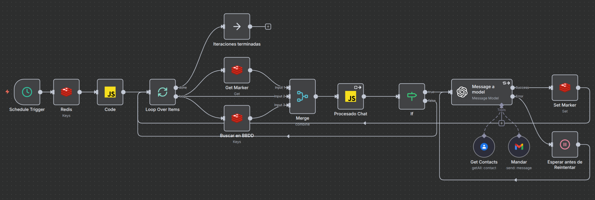

</p\>

# 1\. Resumen de Conversación (Agente Asistente)

Este workflow de n8n implementa un **agente de resúmenes automático** que actúa como un servicio de soporte para el proyecto principal [**KykeBot (Asistente Personal)**](https://github.com/funkykespain/workflows-n8n-publicos/tree/main/KykeBot).

Su función es **monitorizar, procesar y resumir** de forma inteligente todas las conversaciones que los usuarios tienen con KykeBot. El objetivo es proporcionar a Enrique Aranda un **informe diario por email** que contenga únicamente los *nuevos mensajes* de cada conversación, permitiéndole estar al tanto de todas las interacciones sin tener que revisar manualmente las bases de datos o los chats.

-----

## 🎯 2. Propósito y Proyecto Relacionado

Este workflow no es un bot con el que se pueda interactuar. Es un **proceso de *backend* (backend process)** que se ejecuta de forma programada para dar soporte al siguiente proyecto:

  * **Proyecto Principal:** [**KykeBot - Mayordomo Digital**](https://github.com/funkykespain/workflows-n8n-publicos/tree/main/KykeBot)
  * **Función:** KykeBot gestiona las conversaciones en tiempo real. Este workflow (`Resumen Conversación`) se ejecuta una vez al día (a las 6:00 AM) para leer las bases de datos de KykeBot y enviar los resúmenes de lo que ha ocurrido.

-----

## ⚙️ 3. Requisitos previos

Para que este workflow funcione, necesitarás:

  * Una instancia de **n8n** (local o en la nube).
  * Dos bases de datos **Redis**:
    1.  Una para la memoria del chat de KykeBot (ej: `Redis -chat-perso`).
    2.  Una para los perfiles de usuario de KykeBot (ej: `Redis -usuario-perso`).
  * Credenciales de API para:
      * **OpenAI** (para el modelo de resumen, ej: `gpt-4o-mini`).
      * **Google Contacts** (para buscar los nombres de los contactos).
      * **Gmail** (para enviar el email de resumen).

-----

## 📦 4. Archivos incluidos

  * `Resumen Conversación.json`: El export completo del workflow de n8n.
  * `profile.png`: Imagen de perfil del autor.
  * `schema.jpg`: Diagrama visual del workflow.
  * `README.md`: Este documento explicativo.

-----

## 🚀 5. Instalación e Importación del Workflow

1.  Descarga el archivo `Resumen Conversación.json`.
2.  En tu instancia de n8n, ve a **Import \> From File**.
3.  Selecciona el archivo `Resumen Conversación.json` y guarda el workflow.
4.  **Importante: Configurar Credenciales.** Este flujo utiliza múltiples credenciales que deberás crear y asignar:
      * `Redis -chat-perso` (Credencial de Redis): En los nodos `Redis` (inicial), `Get Marker` y `Set Marker`.
      * `Redis -usuario-perso` (Credencial de Redis): En el nodo `Buscar en BBDD`.
      * `OpenAi account` (Credencial de OpenAI): En el nodo `Message a model`.
      * `Contacts Perso` (Credencial de Google Contacts): En el nodo `Get Contacts`.
      * `Gmail perso` (Credencial de Gmail): En el nodo `Mandar`.
5.  **Configurar Email:** Revisa el nodo `Mandar` (Gmail) y asegúrate de que el campo `sendTo` contenga tu dirección de email.
6.  Activa el workflow.

-----

## 🧩 6. Estructura del Workflow

Este workflow se inicia con un `Schedule Trigger` que lo ejecuta todos los días a las 6:00 AM.

El flujo principal se divide en los siguientes pasos:

### 1\. Obtener Todas las Conversaciones

  * **`Schedule Trigger`**: Inicia el flujo a las 6:00 AM.
  * **`Redis`**: Se conecta a la BBDD `Redis -chat-perso` y obtiene **todas** las claves (`*`).
  * **`Code`**: Filtra las claves. Excluye las claves de servicio (ej: `summary_marker:...`) y prepara una lista limpia de todas las conversaciones (ej: `chat:34666...`) para ser procesadas.

### 2\. Bucle por Conversación (`Loop Over Items`)

  * El flujo itera sobre cada clave de conversación identificada en el paso anterior. Para cada una, ejecuta la siguiente lógica en paralelo.

### 3\. Carga de Contexto (Paralelo)

Dentro del bucle, tres nodos se ejecutan simultáneamente para recopilar toda la información necesaria:

1.  **`Get Marker` (Redis)**: Busca una clave especial (ej: `summary_marker:chat:34666...`). Esta clave almacena el **número de mensajes** que ya fueron resumidos en la ejecución anterior.
2.  **`Buscar en BBDD` (Redis)**: Busca la misma clave en la *otra* base de datos (`Redis -usuario-perso`) para obtener datos de perfil del usuario (nombre, email, notas, etc.) que KykeBot haya guardado.
3.  **Item del Bucle**: Pasa los datos de la conversación actual (la clave y el historial de chat completo).

<!-- end list -->

  * **`Merge`**: Une los resultados de estas tres ramas. Ahora tenemos el historial completo, el índice del último mensaje resumido y los datos del perfil del usuario.

### 4\. Procesado de Nuevos Mensajes

  * **`Procesado Chat` (Code)**: Este es un paso crucial. Compara la longitud total del historial (ej: 50 mensajes) con el índice guardado en el *marker* (ej: 48 mensajes).
      * Calcula que hay `50 - 48 = 2` mensajes nuevos.
      * Extrae solo esos 2 mensajes nuevos, los formatea de JSON a texto plano (ej: `human: ...`, `AI: ...`) y los prepara para la IA.
      * Si no hay mensajes nuevos (50 - 50 = 0), el nodo devuelve `null`.

### 5\. Condicional (`If`)

  * Comprueba si el nodo `Procesado Chat` ha devuelto mensajes.
      * **True**: Hay mensajes nuevos. Pasa al Agente de IA.
      * **False**: No hay mensajes nuevos. Vuelve al `Loop Over Items` para procesar la siguiente conversación.

### 6\. Agente de Resumen y Envío (IA)

  * **`Message a model` (OpenAI)**: Este es el cerebro del resumen. Utiliza `gpt-4o-mini` y tiene un *system prompt* detallado que le ordena ejecutar 3 tareas:
    1.  **Tarea 1 (Tool: `Get Contacts`)**: La IA primero usa la herramienta `Get Contacts` para buscar en Google Contacts el nombre asociado al número de teléfono. Prueba múltiples formatos (`+34...`, `0034...`, `666...`) hasta encontrarlo. Si no lo encuentra, usa "Desconocido".
    2.  **Tarea 2 (Resumen)**: Lee el historial de mensajes nuevos y lo resume en un máximo de 4 frases, más una frase final sobre el tono de la conversación.
    3.  **Tarea 3 (Tool: `Mandar`)**: La IA usa la herramienta `Mandar` (Gmail) para redactar y enviar el email con el formato HTML especificado, rellenando el `displayName` (de la Tarea 1) y el resumen (de la Tarea 2).

### 7\. Actualización del Marcador

  * **`Set Marker` (Redis)**: Una vez que el email se ha enviado correctamente, este nodo actualiza el *marker* en Redis (ej: `summary_marker:chat:34666...`) al nuevo valor total (ej: `50`).
  * Esto garantiza que en la próxima ejecución (al día siguiente), esos 50 mensajes se marquen como "ya procesados" y el flujo solo resuma los que vengan después.

### 8\. Gestión de Errores

  * Si el nodo `Message a model` falla (ej: error de API de OpenAI), el flujo se desvía a `Esperar antes de Reintentar` (espera 10 segundos) y vuelve a intentar la operación, asegurando que no se pierdan resúmenes por fallos temporales.

-----

## 🔧 7. Optimizaciones y Características Clave

  * **Procesamiento Diferencial (Marcadores)**: La característica más importante. El uso de claves `summary_marker:` en Redis permite al workflow ser **extremadamente eficiente**. En lugar de re-procesar todo el historial de chat cada día, solo procesa los mensajes nuevos (el "delta") que han llegado desde la última ejecución.
  * **Enriquecimiento de Datos (Multi-DB y Multi-API)**: El resumen no es solo texto. El flujo enriquece el email final combinando datos de tres fuentes distintas:
    1.  `Redis -chat-perso` (Historial de chat)
    2.  `Redis -usuario-perso` (Datos de perfil del usuario)
    3.  `Google Contacts API` (Nombre real del contacto)
  * **Agente Orquestador (IA con Herramientas)**: El nodo de OpenAI no es un simple LLM; actúa como un agente. El *prompt* le da autoridad para *decidir* y *ejecutar* herramientas (`Get Contacts`, `Mandar`) en la secuencia correcta para completar su objetivo.
  * **Robustez y Reintentos**: El bucle de reintento con espera (`Esperar antes de Reintentar`) previene que fallos puntuales de la API de OpenAI dejen conversaciones sin resumir, aumentando la fiabilidad del informe diario.
  * **Eficiencia de Carga**: El uso de un nodo `Code` inicial para filtrar las claves *antes* del bucle (`Loop Over Items`) reduce la carga de trabajo, asegurando que el bucle solo itere sobre conversaciones reales.

-----

## ⚙️ 8. Variables y Credenciales

Asegúrate de configurar las siguientes 5 credenciales en tu instancia de n8n:

1.  **`Redis -chat-perso`** (Redis): Usada en `Redis`, `Get Marker`, `Set Marker`.
2.  **`Redis -usuario-perso`** (Redis): Usada en `Buscar en BBDD`.
3.  **`OpenAi account`** (OpenAI): Usada en `Message a model`.
4.  **`Contacts Perso`** (Google Contacts): Usada en la herramienta `Get Contacts`.
5.  **`Gmail perso`** (Gmail): Usada en la herramienta `Mandar`.

-----

## 🧾 9. Ejemplo de Ejecución

1.  **Trigger (6:00 AM)**: El workflow se inicia.
2.  **Redis** obtiene `chat:346667788` y `summary_marker:chat:346667788`.
3.  **`Loop Over Items`**: Comienza el bucle para `chat:346667788`.
4.  **`Get Marker`**: Obtiene el valor `48` (48 mensajes ya resumidos).
5.  **`Procesado Chat`**: Lee el historial completo, que ahora tiene 50 mensajes. Calcula que `50 - 48 = 2` mensajes nuevos. Extrae y formatea esos 2 mensajes.
6.  **`If`**: Detecta que hay 2 mensajes, continúa.
7.  **`Message a model`**:
      * Llama a `Get Contacts` con `+346667788`. La API devuelve "Carlos Ejemplo".
      * Lee los 2 mensajes nuevos: `human: Perfecto, muchas gracias` y `AI: Ha sido un placer. ¡Buen día!`.
      * Genera el resumen: "Se finaliza la consulta sobre el proyecto X. El usuario se despide agradecido. El tono de la conversación fue cordial."
      * Llama a `Mandar` con:
          * **Asunto**: `Carlos Ejemplo: Cierre de consulta proyecto X`
          * **Cuerpo**: (HTML formateado con el resumen y los datos de "Carlos Ejemplo").
8.  **`Set Marker`**: El email se envía. Este nodo actualiza `summary_marker:chat:346667788` al nuevo valor: `50`.
9.  **Fin**: El bucle termina y espera al día siguiente.

-----

## 🔧 10. Personalización

  * **Email de Destino:** Para cambiar quién recibe el resumen, edita el parámetro `sendTo` en el nodo `Mandar` (ID: `1c9a...`).
  * **Formato del Resumen:** Para cambiar cómo se ve el email, el asunto o las frases del resumen, edita el **System Prompt** dentro del nodo `Message a model` (ID: `00db...`).
  * **Frecuencia:** Para cambiar cuándo o con qué frecuencia se ejecuta el workflow, edita el nodo `Schedule Trigger` (ID: `7437...`).

-----

## 🧑‍💻 11. Autor

Desarrollado por [Enrique Aranda](https://www.linkedin.com/in/earanda/)
(Workflows públicos de `funkykespain`).

-----

## 📄 12. Licencia

Este proyecto se distribuye bajo la licencia MIT.
